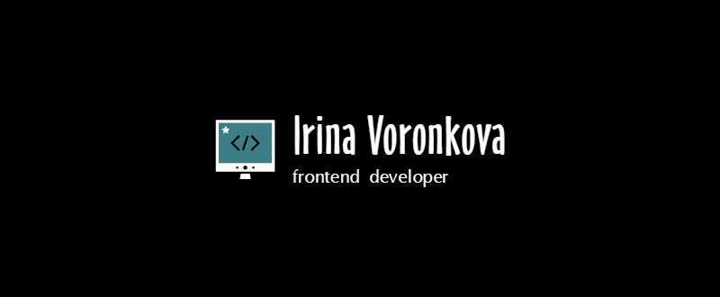

<!-- # Привет 👋 👌
## Меня зовут Ирина
## Я начинающий веб-разработчик 🌙🌙🌙

- изучаю Vue.js
- работаю над [проектом](https://github.com/Afkeomre/knitwear-shop.git)

### Языки и инструменты

 -->

<!--
**Afkeomre/Afkeomre** is a ✨ _special_ ✨ repository because its `README.md` (this file) appears on your GitHub profile.

Here are some ideas to get you started:

- 🔭 I’m currently working on ...
- 🌱 I’m currently learning ...
- 👯 I’m looking to collaborate on ...
- 🤔 I’m looking for help with ...
- 💬 Ask me about ...
- 📫 How to reach me: ...
- 😄 Pronouns: ...
- ⚡ Fun fact: ...
-->